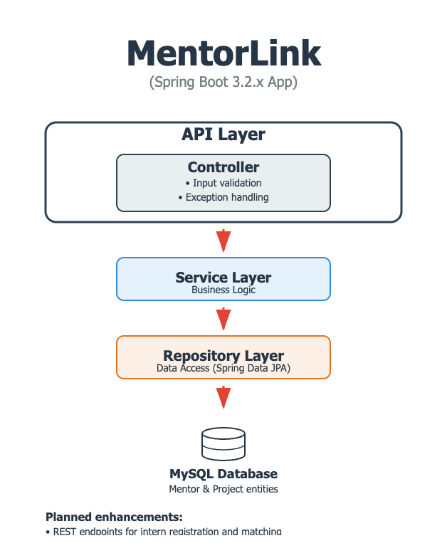

# MentorLink

**MentorLink** is a Spring Boot–based web application designed to help organizations run mentorship programs efficiently.  
It provides tools for assigning projects to mentors, enforcing workload limits, and retrieving mentor availability — making it easier to scale and manage structured mentorship initiatives.

## Core Features

The application allows administrators to:

- Allocate a new project to a mentor (up to 3 projects per mentor)
- Retrieve mentors based on the number of projects they are mentoring
- Update the mentor assigned to a specific project
- Delete a project and automatically update the mentor’s workload

Planned enhancements include the ability to register interns and match them to mentors based on skills and interests.

## Workload Tracking

MentorLink keeps track of each mentor’s workload by counting the number of active projects assigned to them.  
The system enforces a maximum of three projects per mentor. Each time a project is created, updated, reassigned, or deleted, the workload count is automatically adjusted in the database using Spring Data JPA.  
Mentors can also be queried based on their current workload, allowing administrators to make informed assignment decisions.

## Technical Stack

- Java 21
- Spring Boot 3.2.x
- Spring Data JPA
- MySQL
- RESTful APIs
- Jakarta Bean Validation
- Maven
- JUnit 5 and Mockito (planned)

## Architecture



MentorLink follows a clean layered architecture with clear separation of concerns:
- **Controller Layer**: Handles HTTP requests, validation, and exception handling
- **Service Layer**: Contains business logic and orchestrates operations
- **Repository Layer**: Manages data persistence using Spring Data JPA

## API Design

The application exposes RESTful endpoints for all major operations. It supports:

- Input validation with `@Valid` and Jakarta Bean Validation
- Centralized exception handling via `@ControllerAdvice`
- Clear separation of concerns between controller, service, and repository layers

## Development Status

MentorLink is currently under development. The backend structure is in place and the core features are being implemented.  
A frontend React interface is planned for future integration.

## How to Run the Project Locally
### Prerequisites
- Java 21
- MySQL 8.0+
- Maven (or use included wrapper `./mvnw`)

### Setup Steps

### 1. Clone the repository:

```bash
git clone https://github.com/gaebar/mentorlink.git
cd mentorlink
```
  
### 2. Create the MySQL database:

```sql
CREATE DATABASE mentorlink_db;
```
### 3. Configure database connection:
Edit the `src/main/resources/application.properties` file and update the following lines:
```properties
spring.datasource.url=jdbc:mysql://localhost:3306/mentorlink_db
spring.datasource.username=your_username
spring.datasource.password=your_password
```
### 4. Build and run the project:
```bash
./mvnw spring-boot:run
```

### 5. Access the application:

Once the application is running, open your browser and go to:

[http://localhost:8080](http://localhost:8080)


## Inspiration

This project was inspired by my experience as a mentor and speaker in July 2025 during a two-week summer coding camp organized by the nonprofit organization [Kode with Klossy](https://www.kodewithklossy.com/).  
The camp focused on web development and STEAM education (Science, Technology, Engineering, Arts, and Mathematics) for girls and non-binary teens aged 13 to 18.

MentorLink builds on that experience to explore how structured mentorship tools can support learning, capacity planning, and equity in tech education programs.

## Author

[Gaetano Barreca](https://github.com/gaebar)
